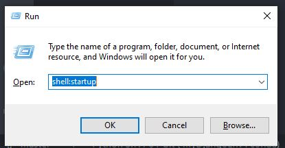
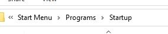

# Filesystem-Monitoring
A basic Filesystem or Directory Event Monitoring tool for Windows built using Python's API Library "[Watchdog](https://github.com/gorakhargosh/watchdog)".

Works on Python 3+.

This program uses Tkinter as the control center interface to help start and stop the observers. It also uses multiprocessing to process multiple directories event handlers. It has a basic start-up functionality to start the program whenever you Login, this can be easily disabled (instructions [Here](https://github.com/Chefcury1/Filesystem-Monitoring#disable-startup-functionality)). 


## Supported Platforms
- Windows

A pull request will be appreciated for any other platform integration.

## Dependencies

This module depends on the [Watchdog](https://github.com/gorakhargosh/watchdog) Library to monitor the directories specified in the list and logs the events in a specified text file.
 
Install using `pip`:

```Python
pip install watchdog # Or pip3 install watchdog
```

Install from PyPI using `pip`:

```Python
python -m pip install -U watchdog
```


## Usage

To use this program, all you need to do is change the paths below in the "__`main.py`__" file to the corresponding paths on your PC.

```Python
directories_to_watch = ["C:\\your_dir_1", "C:\\your_dir_2", "F:\\your_dir_3", "F:\\your_dir_4"]
path_to_write = "C:\\your_dir_5"
file_name = "filesystem_monitoring.txt"
start_file_on_login_path = "C:\\path_to_main.py_file_on_your_pc\\filesystem_monitoring\\src\\main.py"
startup_path = 'C:\\Users\\username\\AppData\\Roaming\\Microsoft\\Windows\\Start Menu\\Programs\\Startup'
```

For the naming examples below we would use a username called "**_`explo1`_**".

__NOTE__: Ensure to include "__2 (TWO)__" __Backslash__ in ALL PATHS BELOW e.g "`C:\Users\explo1\Desktop`" should be "`C:\\Users\\explo1\\Desktop`"


- The `directories_to_watch` list simply holds all the specified directories you intend to monitor:

    Include directory or directories you want to moitor within double quotes and square brackets: 
    `directories_to_watch = ["C:\\your_dir"]`

    Seperate Multiple directories with comma ',': `directories_to_watch = ["C:\\your_dir_1", "F:\\your_dir_2"]`

```Python
directories_to_watch = ["C:\\Users\\explo1\\Documents", "C:\\Users\\explo1\\Pictures", "F:\\Programming"]
```


The `path_to_write` variable is the path to which the log event file will be stored e.g when a file is "created" or "deleted" the log event will be stored in a text file, and this is the path the log file will be saved. __NOTE__: Ensure this path is **not included** in the `directories_to_watch` list above.

```Python
# NOTE: This path is not included in the "directories_to_watch".
path_to_write = "C:\\Users\\explo1\\Desktop"
```


The `file_name` variable is the name given to the event log file. This can be renamed accordingly.

```Python
file_name = "monitoring_logs.txt"
```


The `start_file_on_login_path` this is the path to the __main.py__ file in this program on your PC. This variable is in needed to start the program automatically whenever you log into you system. 

```Python
start_file_on_login_path = "C:\\Users\\explo1\\Downloads\\filesystem_monitoring\\src\\main.py"
```

To disable start-up functionality follow the instructions [Here](https://github.com/Chefcury1/Filesystem-Monitoring#disable-startup-functionality)


The `startup_path` this is the path to your PC's Startup directory. To find Startup folder path -> press `WinKey + R`, then type `shell:startup` and hit `Enter` to get path.

 

```Python
startup_path = 'C:\\Users\\explo1\\AppData\\Roaming\\Microsoft\\Windows\\Start Menu\\Programs\\Startup'
```